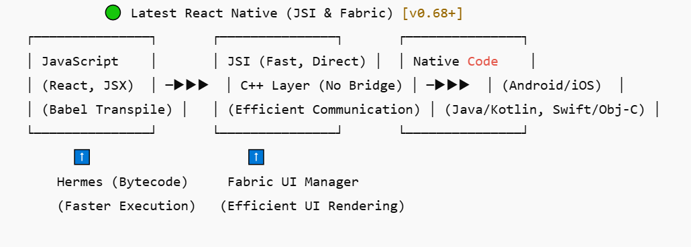
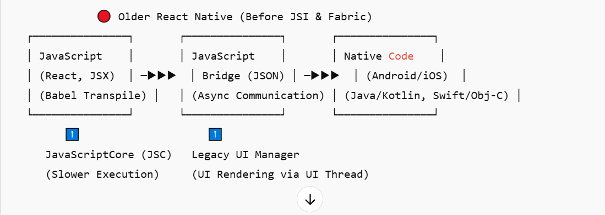

 

  [⬅ Go Back](./Index.md) 
 <h1 style="text-align: center; margin: 0; color:#00fc04; ">React Native Introduction</h1>
  

  <h1 style=" margin: 0; color:#57acf2; ">What is React native?</h1>
  
- React Native is an open-source framework developed by Meta (formerly Facebook) that allows developers to build cross-platform mobile applications using JavaScript and React.
- Instead of writing separate codebases for iOS (Swift) and Android (Kotlin/Java), React Native enables developers to write once and run on both platforms using a single codebase.

<h2 style=" margin: 0; color:#57acf2; "> How does it works:</h2>

`Since React Native doesn’t have a real DOM, it doesn’t use the Virtual DOM like React Web does. Instead, React Native optimizes re-renders using a Shadow Tree and Native Bridge. Let’s break it down`

### **React Native Uses a Shadow Tree Instead of Virtual DOM**
- React Native maintains a Shadow Tree, which is a lightweight representation of UI elements.
- Instead of updating a DOM tree, it directly updates Native Views using Yoga Layout Engine (a flexbox-based engine for layout calculations).

- Uses React: React Native follows the same principles as React.js for building UIs using components and state management.

- Bridges to Native Code: React Native converts JavaScript code into native code (Objective-C, Swift for iOS & Java, Kotlin for Android) using a JavaScript bridge.
- Prebuilt Native Components: Provides core components like <View>, <Text>, and <Image> that map directly to native UI elements.
- Fast Development: Features like Hot Reloading and Fast Refresh allow developers to see changes instantly.

- How does React Native differ from React.js?
  - React.js is for web, while React Native is for mobile with native components.

- How does React Native achieve native performance?
  - It uses native components and bridges JavaScript with native code.

- What are the limitations of React Native? 
  - It may require native modules for performance-heavy tasks (e.g., AR, VR, Video Processing).

 
<h2 style=" margin: 0; color:#57acf2; ">How Does React Native Convert Code to Native in the Latest Versions?</h2>

In the latest versions of React Native (0.70+), the traditional JavaScript Bridge has been replaced with a new architecture that improves performance and reduces bottlenecks.

 <h3 style=" margin: 0; color:#57acf2; ">Previously (Old Architecture):</h3>

  - Used a JavaScript Bridge to communicate between JavaScript and Native modules.
  - This caused performance issues, especially in heavy animations and complex UI updates.

<h3 style=" margin: 0; color:#57acf2; "> New Architecture in React Native (Fabric & TurboModules)</h3>

 - React Native now uses Fabric and TurboModules instead of the JavaScript Bridge:

  - Fabric (New Rendering System)
  -  Direct Communication between JavaScript and Native UI components.
  -  Uses C++ for rendering, reducing overhead.
  -  Faster UI updates with asynchronous rendering.

    -  TurboModules (New Native Module System)
    -  Loads native modules on demand, reducing startup time.
    -  Improves memory management and efficiency.
    -  Uses JSI (JavaScript Interface) to call native code directly in C++.

<h3 style=" margin: 0; color:#57acf2; ">How React Native Works Now?</h3>
JSI (JavaScript Interface) replaces the old Bridge.
Fabric renders UI elements directly via C++.
TurboModules handle communication with native APIs efficiently.
 -  Impact of the New Architecture:
 -  50% Faster UI Updates
 -  Lower Memory Usage
 -  Improved Performance on Low-End Devices
 
 
 <h3 style=" margin: 0; color:#46b3f2; width:auto"> Answer Summary </h3>
 > React Native no longer uses the JavaScript Bridge. Instead, it uses JSI (JavaScript Interface) for direct communication with native code. It also introduces Fabric (new UI rendering system) and TurboModules (efficient native module handling), improving performance and reducing memory overhead. 

 ## How the Full Process Works in `Latest React Native Versions`
1️⃣ **Babel** : `transpiles JSX & ES6+ to plain JavaScript.`  
2️⃣ **Hermes** : `compiles JavaScript to bytecode for faster execution.` 
3️⃣ **JSI** : `connects JavaScript logic to native C++, Java, and Swift code.` 
4️⃣ **Fabric** : `renders UI elements efficiently using C++.` 
5️⃣ **Gradle/Xcode** : `compiles platform-specific code for Android & iOS.` 

## How the Full Process Worked in `Older React Native Versions`
1️⃣ **Babel** : `transpiled JSX & ES6+ to plain JavaScript.`  
2️⃣ **JavaScriptCore (JSC)** : `executed JavaScript directly using a JavaScript engine (slower than Hermes)`. 
3️⃣ **JavaScript Bridge** : `sent asynchronous JSON messages between JavaScript and native code (causing performance bottlenecks)`. 
4️⃣ **Legacy UI Manager** : `used a separate UI thread to render native components, leading to delays.` 
5️⃣ **Gradle/Xcode** :` compiled platform-specific code for Android & iOS.` 

### For more clarification go through image

## **Key Takeaways**
- React Native doesn’t have a real DOM, so it doesn’t use Virtual DOM.
- Instead, it has a Shadow Tree that helps calculate UI updates.
- It updates UI components via the React Native Bridge (JavaScript ↔ Native).
- Re-render optimizations include React.memo, useMemo, useCallback, and list optimizations (FlatList).
- Only changed components update, preventing full reloads.

